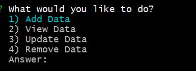
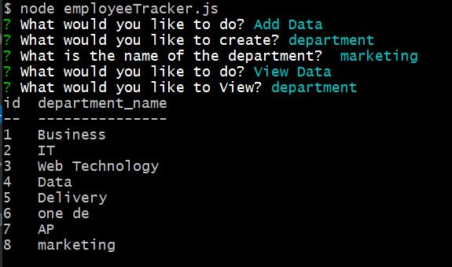
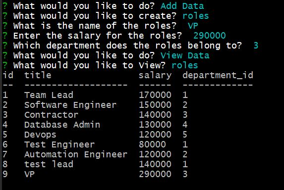
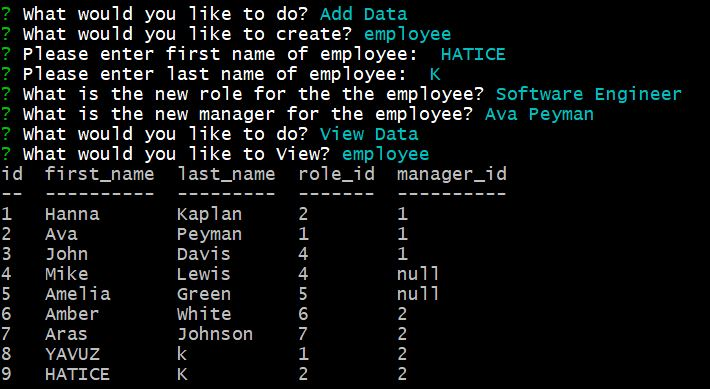
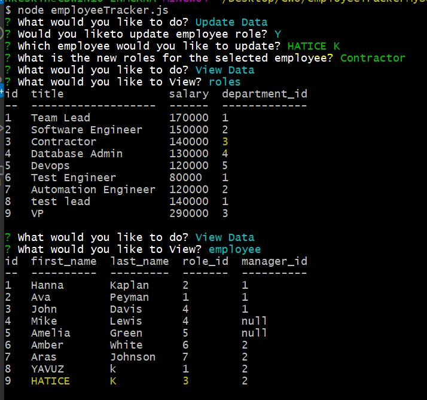

# MySQL Employee Tracker

## Description

This app is solution for managing a company's employees using node, inquirer, and MySQL.
Command-line application allows the user to:

  * Add departments, roles, employees

  * View departments, roles, employees

  * Update employee roles

## User Story
```
As a business owner
I want to be able to view and manage the departments, roles, and employees in my company
So that I can organize and plan my business
```

## Database

Following database schema designed containing three tables:

* **department**:

  * **id** - INT PRIMARY KEY
  * **name** - VARCHAR(30) to hold department name

* **role**:

  * **id** - INT PRIMARY KEY
  * **title** -  VARCHAR(30) to hold role title
  * **salary** -  DECIMAL to hold role salary
  * **department_id** -  INT to hold reference to department role belongs to

* **employee**:

  * **id** - INT PRIMARY KEY
  * **first_name** - VARCHAR(30) to hold employee first name
  * **last_name** - VARCHAR(30) to hold employee last name
  * **role_id** - INT to hold reference to role employee has
  * **manager_id** - INT to hold reference to another employee that manages the employee being Created. This field may be null if the employee has no manager
  


## Technologies

* Used the [MySQL](https://www.npmjs.com/package/mysql) NPM package to connect to MySQL database and perform queries.

* Used [InquirerJs](https://www.npmjs.com/package/inquirer/v/0.2.3) NPM package to interact with the user via the command-line.

* Used [console.table](https://www.npmjs.com/package/console.table) to print MySQL rows to the console.

## Screenshot

* Main screenshot


* Add View Department screenshot


* Add View Roles screenshot


* Add View Employee screenshot


* Update Employee Role screenshot



## Table of Contents

* Title

* Description

* User Story

* Database

* Technologies

* Screenshot

* Table of Contents

* Installation

* Usage

* Questions

* Urls

* Video

## Installation

```md
npm install 
```

## Usage

```md
node employeeTracker.js
```

## Questions
Contact with me with any questions : [GitHub](https://github.com/kinziva)<br />

## Urls
* Repository [Repository URL ](https://github.com/kinziva/employeeTrackerMySQL)

## Video
 Click to Watch! Video Walktrough [![https://youtu.be/qs77HvYrYUY]](https://youtu.be/qs77HvYrYUY/ "Employee Tracker -  usage definition!") Explained following in the Video.
* How to run the app
* How to select responses for the app 
* How to view , add and update